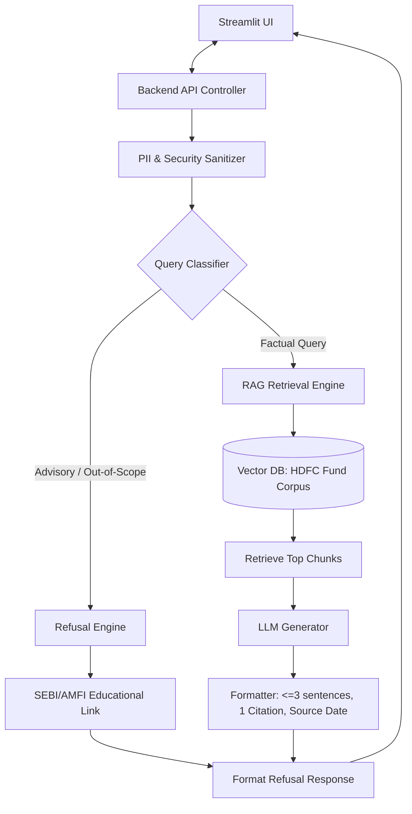

# System Architecture: Mutual Fund FAQ Assistant

This document outlines the architecture, data flow, and component design for the compliant, facts-only Mutual Fund FAQ Assistant. The system uses a Retrieval-Augmented Generation (RAG) framework tailored to deliver accurate, source-backed information while enforcing strict compliance guardrails.

---

## 🗺️ System Overview

The application is structured into three main layers:
1.  **User Interface Layer:** A minimalist Streamlit web application.
2.  **Logic & Guardrails Layer:** Responsible for input sanitization, query classification (factual vs. advisory), and refusal handling.
3.  **RAG & Retrieval Layer:** Handles chunk indexing from the Groww document corpus, vector similarity search, and generation using a constrained LLM prompt.



---

## 🛠️ Detailed Component breakdown

### 1. User Interface (UI)
*   **Technology:** Streamlit (Python)
*   **Elements:**
    *   Clean welcome message and header.
    *   Prominent Disclaimer Banner: `⚠️ Facts-only. No investment advice.`
    *   Interactive chat interface.
    *   Quick-Start Buttons: Three clickable example questions to guide user expectations (e.g., *"What is the expense ratio of the HDFC Defence Fund?"*).

### 2. Privacy & Security Sanitizer (Middleware)
*   **Function:** Intercepts user queries before passing them to any external service or model.
*   **Rules:** Scans for and redacts PII using Regex pattern matching:
    *   PAN (Permanent Account Number)
    *   Aadhaar Card numbers
    *   Bank account numbers & OTPs
    *   Email addresses & Phone numbers
*   **Behavior:** If PII is detected, the query is sanitized, or the user is prompted to resubmit without sharing personal details.

### 3. Query Classifier (Compliance Guardrails)
*   **Function:** Classifies the incoming query into one of two paths:
    1.  **Factual (Allowed):** Technical/objective queries (expense ratios, exit loads, fund managers, lock-in periods, benchmark indices).
    2.  **Advisory (Refused):** Recommendation or opinion queries (*"Which fund should I buy?"*, *"Is HDFC Small Cap a good investment?"*, *"Compare returns"*).
*   **Implementation:** Lightweight zero-shot prompt classification via an LLM or keyword-based router.

### 4. RAG Retrieval Engine
*   **Data Ingestion & Indexing Pipeline:**
    ```mermaid
    flowchart LR
        Scheduler[Daily Scheduler: Cron/APScheduler] -->|Trigger 00:00 Daily| WebScrape[Scrape 5 Groww URLs]
        WebScrape -->|Scrape & Clean| JSONFile[(Local JSON File: data/schemes.json)]
        JSONFile -->|Load & Chunk| Indexer[Indexer: Markdown Section Splitter]
        Indexer --> Embed["Embedding Model: BAAI/bge-small-en-v1.5 (Local)"]
        Embed --> VectorStore[(Vector Database: Chroma / FAISS)]
    ```
*   **Retrieval:** Uses semantic similarity search (cosine similarity) to fetch the top $k$ chunks matching the factual query.
*   **Corpus Scope (5 HDFC Funds on Groww):**
    *   [HDFC Silver ETF FoF Direct Growth](https://groww.in/mutual-funds/hdfc-silver-etf-fof-direct-growth)
    *   [HDFC Small Cap Fund Direct Growth](https://groww.in/mutual-funds/hdfc-small-cap-fund-direct-growth)
    *   [HDFC Defence Fund Direct Growth](https://groww.in/mutual-funds/hdfc-defence-fund-direct-growth)
    *   [HDFC Gold ETF Fund of Fund Direct Plan Growth](https://groww.in/mutual-funds/hdfc-gold-etf-fund-of-fund-direct-plan-growth)
    *   [HDFC Nifty 50 Index Fund Direct Growth](https://groww.in/mutual-funds/hdfc-nifty-50-index-fund-direct-growth)

### 5. Data Refresh & Scheduler Component
*   **Technology:** `APScheduler` (Advanced Python Scheduler) run as a background service or integrated inside a system `cron` daemon.
*   **Schedule Trigger:** Daily execution at midnight (`00:00` Local Time).
*   **Process Flow:**
    1.  **Trigger Scrape:** The scheduler starts the ingestion component daily.
    2.  **Save to JSON:** Scraped pages are cleaned and saved to the local file `data/schemes.json`.
    3.  **Fetch & Diff check:** Compare fetched metrics with previous states. If nothing has changed, it exits to preserve API limits and computing resources.
    4.  **Index Database:** The indexer loads the JSON file, generates Markdown sections (Overview, Manager Profiles, Documents), and upserts chunks into ChromaDB.
    5.  **Date Update:** Sets the application-wide metadata `LAST_UPDATED` timestamp to the current run date.

### 6. LLM Prompt Constraints & Formatting
*   **System Prompt Guidelines:**
    *   *Role:* You are an automated factual index. You only answer using the provided context.
    *   *Tone:* Objective, brief, direct. No suggestions or predictions.
    *   *Length Constraint:* Maximum **3 sentences**.
    *   *Citation Rule:* Must output exactly **one citation link** referencing the source Groww URL.
    *   *Footer:* Must append the date the facts were retrieved: `Last updated from sources: <date>`.

---

## 🔒 Security & Compliance Checklist

> [!IMPORTANT]
> **Strict Facts-Only Isolation**
> The system must NEVER perform cross-scheme recommendations or offer opinions. All performance calculations are banned; the bot must link the user to the official factsheet instead.

> [!WARNING]
> **PII Protection**
> Under no circumstances should PAN, Aadhaar, or Bank accounts be logged or processed by the vector store or the main LLM pipeline.

---

## 📈 Request Execution Flow

1.  **Query Input:** User asks a question (e.g. *"Who is the fund manager for HDFC Defence Fund?"*).
2.  **Sanitization:** The input is screened for PII.
3.  **Classification:** The query classifier determines that the request is factual and relates to fund managers.
4.  **Semantic Search:** The RAG system searches the Vector Database and extracts HDFC Defence Fund chunks containing fund manager names and experience.
5.  **Constrained Completion:** The LLM receives the chunks and outputs a concise response matching the rules:
    > "The HDFC Defence Fund is managed by Mr. Dhruv Muchhal. He has over 10 years of experience in equity research and fund management.
    >
    > Source: [HDFC Defence Fund on Groww](https://groww.in/mutual-funds/hdfc-defence-fund-direct-growth)
    > Last updated from sources: June 2026"
