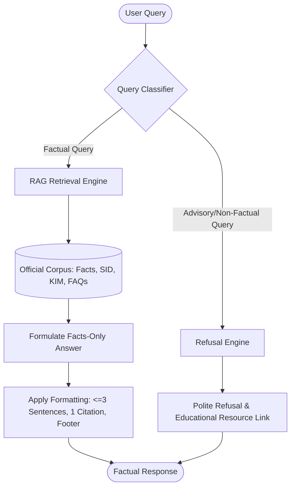

# Mutual Fund FAQ Assistant (Facts-Only Q&A)

## 📌 Project Overview
The objective of this project is to build a compliant, facts-only FAQ assistant for mutual fund schemes, using **Groww** as the reference product context. The assistant answers objective, verifiable queries by retrieving information exclusively from official public sources:
*   Asset Management Company (AMC) websites
*   Association of Mutual Funds in India (AMFI)
*   Securities and Exchange Board of India (SEBI)

The system is strictly prohibited from providing investment advice, opinions, or recommendations. Every response must include a single, clear source link and adhere to strict formatting and content constraints.

---

## ⚙️ Architecture & Logic Flow
Below is the conceptual architecture of the FAQ Assistant, demonstrating the routing of factual queries vs. refusal of advisory queries:

---

## 🎯 Objectives & Scope

### 1. Corpus Definition
*   **Target AMC:** HDFC Mutual Fund (via Groww reference links).
*   **Size:** Currently limited to **5 specific scheme URLs**:
    *   [HDFC Silver ETF FoF Direct Growth](https://groww.in/mutual-funds/hdfc-silver-etf-fof-direct-growth)
    *   [HDFC Small Cap Fund Direct Growth](https://groww.in/mutual-funds/hdfc-small-cap-fund-direct-growth)
    *   [HDFC Defence Fund Direct Growth](https://groww.in/mutual-funds/hdfc-defence-fund-direct-growth)
    *   [HDFC Gold ETF Fund of Fund Direct Plan Growth](https://groww.in/mutual-funds/hdfc-gold-etf-fund-of-fund-direct-plan-growth)
    *   [HDFC Nifty 50 Index Fund Direct Growth](https://groww.in/mutual-funds/hdfc-nifty-50-index-fund-direct-growth)

### 2. FAQ Assistant Capabilities
The assistant must answer facts-only queries including:
*   Expense ratios & exit load details
*   Minimum SIP amounts
*   ELSS lock-in periods
*   Riskometer classifications & benchmark indices
*   Step-by-step procedures for downloading statements or capital gains reports 
*   Fund manager details (e.g., name, experience, other managed schemes) 

### 3. Refusal Handling
For any advisory or opinion-based queries (e.g., *"Should I invest in X fund?"* or *"Which fund is better?"*), the assistant must:
*   Provide a polite and clearly worded refusal.
*   Reinforce the facts-only limitation.
*   Provide a link to an official educational resource (e.g., AMFI or SEBI investor education pages).

---

## ⚠️ Key Constraints

> [!IMPORTANT]
> **Privacy & Security Limitations**
> The system must **never** collect, store, or process sensitive user data, including:
> *   PAN or Aadhaar numbers
> *   Bank account numbers
> *   OTPs
> *   Email addresses or phone numbers

> [!WARNING]
> **No Financial Advice or Comparisons**
> *   **No investment advice** or subjective recommendations.
> *   **No return comparisons** or performance calculations. For performance queries, link directly to the official factsheet.

> [!TIP]
> **Strict Response Formatting Constraints**
> *   **Length:** Maximum of **3 sentences** per response.
> *   **Citations:** Exactly **one citation link** per response.
> *   **Footer:** Must end with:
>     `Last updated from sources: <date>`

---

## 🖥️ User Interface Requirements (Minimal)
*   **Welcome Message:** Simple, clean greeting explaining the tool's purpose.
*   **Quick-Start Prompts:** Exactly three example questions to guide the user.
*   **Disclaimer Banner:** A prominent, visible notice:
    > **"Facts-only. No investment advice."**

---

## 📦 Expected Deliverables
1.  **README Document:** Comprehensive setup guide, selected AMC and schemes, architecture overview (RAG approach), and known limitations.
2.  **Disclaimer Snippets:** Embedded disclaimers across the UI and API layers.
3.  **FAQ Assistant Implementation:** Fully functioning RAG pipeline and user interface.

---

## 📈 Success Criteria
*   [ ] **Accurate Retrieval:** Reliable lookup of factual mutual fund parameters.
*   [ ] **Hallucination Prevention:** Strict adherence to the official corpus only.
*   [ ] **Compliant Citations:** Single valid citation and update timestamp footer in all responses.
*   [ ] **Flawless Refusals:** Appropriate handling of advisory or out-of-scope prompts.
*   [ ] **Minimalist UI:** Clean, intuitive layout following the Groww reference product vibes.
